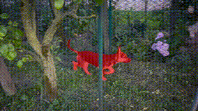
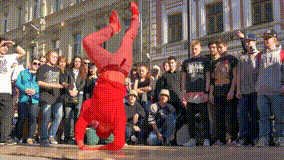
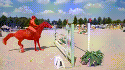
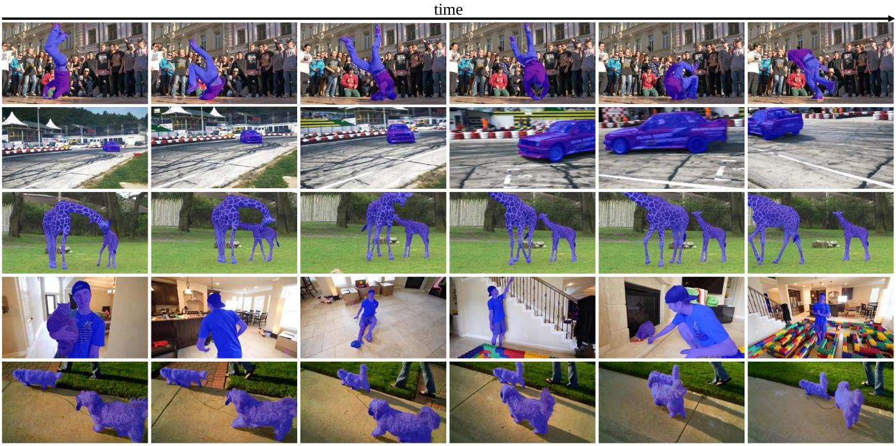

# Learning Motion and Temporal Cues for Unsupervised Video Object Segmentation(Under Review)

**Abstract:** *In this paper, we address the challenges in unsupervised video object segmentation (UVOS) by proposing an efficient algorithm, termed MTNet, which concurrently exploits motion and temporal cues. Unlike previous methods that either merely inherit appearance with motion or model temporal relations, our method combines both aspects by integrating them within a unified framework. MTNet is devised by effectively merging appearance and motion features during the feature extraction process within encoders, promoting a more complementary representation. To capture the intricate long-range contextual dynamics and information embedded within videos, a temporal transformer module is introduced, facilitating efficacious inter-frame interactions throughout a video clip. Finally, a series of decoders are cascaded across all feature levels, aiming to thoroughly harness their potential in producing increasingly precise segmentation masks. As a result, MTNet provides a strong and compact framework that explores both temporal and cross-modality knowledge to robustly localize and track the primary object accurately in various challenging scenarios efficiently. Extensive experiments across diverse benchmarks conclusively show that our method not only attains state-of-the-art performance in unsupervised video object segmentation but also delivers competitive results in video salient object detection. 
These findings highlight the method's robust versatility and its adeptness in adapting to a range of segmentation tasks.*


> Thanks for your interest in this work. Our paper is still under review, now this repository contains only test code, we will release full code after our paper accepted. 

## Demo
  

## Get Started

### Environment

- python == 3.8.15
- torch == 1.10.0
- torchvision == 0.11.0
- cuda == 11.4
- opencv == 4.6.0

### Datasets

Please download the following datasets:

UVOS datasets:

- YouTube-VOS: [YouTube-VOS](https://youtube-vos.org/dataset/)
- DAVIS: [DAVIS](https://data.vision.ee.ethz.ch/csergi/share/davis/DAVIS-2017-trainval-480p.zip)
- YouTube-Objects: [YouTube-Objects](https://data.vision.ee.ethz.ch/cvl/youtube-objects/)
- FBMS: [FBMS](https://lmb.informatik.uni-freiburg.de/resources/datasets/fbms/FBMS_Testset.zip)
- LongVideos: [LongVideos](https://www.kaggle.com/gvclsu/long-videos)

VSOD datasets:

- DAVIS: same as UVOS.
- DAVSOD: [DAVSOD](https://github.com/DengPingFan/DAVSOD)
- SegTrack-V2: [SegTrack-V2](https://github.com/DengPingFan/DAVSOD)
- ViSal: [ViSal](https://github.com/DengPingFan/DAVSOD)

To quickly reproduce our results, we upload the processed data to [Google Drive]() and [Baidu Disk]().

### Models

|    stage    |  model link  |
| :---------: | :----------: |
|  pre-train  | [s1_mtnet]() |
| fine-tuning | [s2_mtnet]() |

To reproduct the results we reported in paper, please download the corresponding models and run test script.

### Training

Waiting

### Testing

Download the trained [MTNet](), and placing it in the `./saves`

```
python test.py [test_model] [task_name] [test_dataset] [output_dir]
```

Testing for UVOS task:

```shell
# Example
# ['DAVIS16', 'YO2SEG', 'FBMS-59', 'LongVideos']
python test.py --test_model ./saves/mtnet.pth --task_name UVOS --test_dataset DAVIS16 --output_dir output
```

Testing for VSOD task:

```shell
# Example
# ['DAVIS16','Easy-35','FBMS-59', 'MCL', 'ViSal', 'SegTrack-V2']
python test.py --test_model ./saves/mtnet.pth --task_name VSOD --test_dataset DAVIS16 --output_dir output
```

### Results

[Precomputed outputs - Google Drive](https://drive.google.com/drive/folders/1V4wslwiGaFHwq09k019tXU1HpG-kODnZ?usp=sharing)

[Precomputed outputs - Baidu Disk](https://drive.google.com/drive/folders/1V4wslwiGaFHwq09k019tXU1HpG-kODnZ?usp=sharing)


### Evaluation

Evaluation for UVOS results:

```shell
# Example
python test_scripts/test_for_davis.py --gt_path ../data/DAVIS16/val/mask --result_path output/MTNet/UVOS/DAVIS16/
```

Evaluation for VSOD results:

```python
# Example
python test_scripts/test_vsod/main.py --method MTNet --dataset DAVIS16 --gt_dir test_scripts/test_vsod/gt/ --pred_dir test_scripts/test_vsod/results/
```

### Visualization



