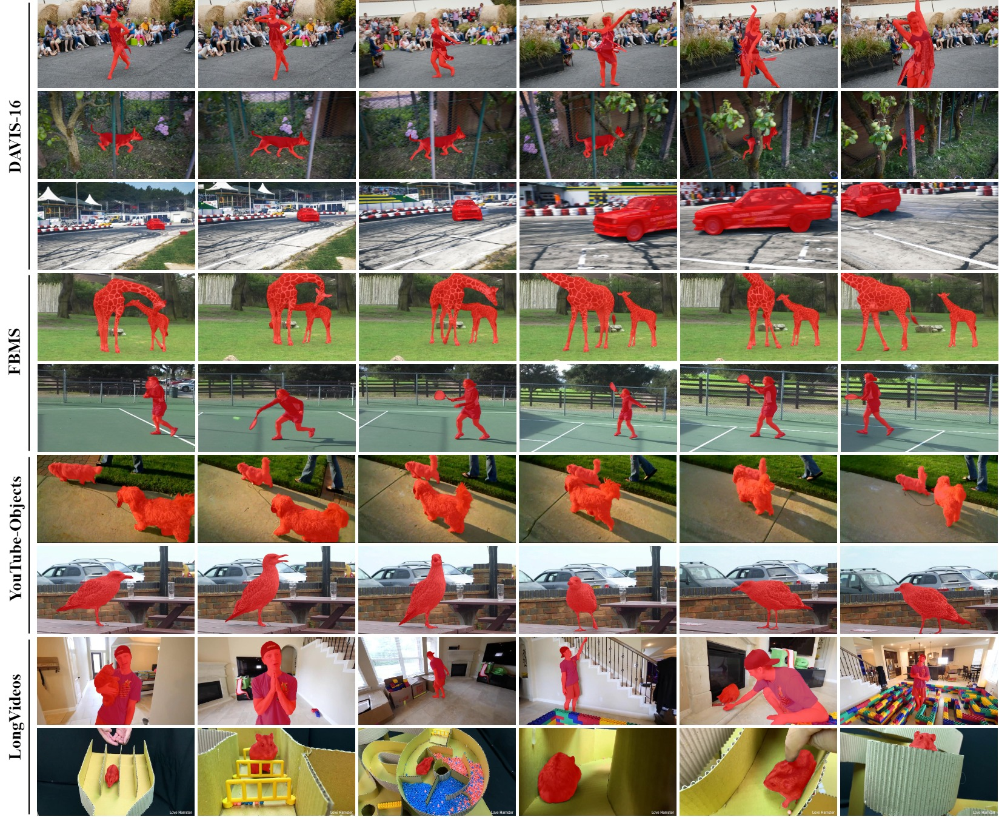

# [TNNLS2024]Learning Motion and Temporal Cues for Unsupervised Video Object Segmentation

## Updates
- [2025-04-26] The training code is now available.
- [2024-06-20] Our paper is accepted at TNNLS 2024.
- [2024-04-16] Initialize the repository, release the test code and the trained model.

## Demo
  

## Get Started

### Environment

- python == 3.8.15
- torch == 1.10.0
- torchvision == 0.11.0
- cuda == 11.4
- opencv == 4.6.0

### Datasets

Please download the following datasets:

UVOS datasets:

- YouTube-VOS: [YouTube-VOS](https://youtube-vos.org/dataset/)
- DAVIS: [DAVIS](https://data.vision.ee.ethz.ch/csergi/share/davis/DAVIS-2017-trainval-480p.zip)
- YouTube-Objects: [YouTube-Objects](https://data.vision.ee.ethz.ch/cvl/youtube-objects/)
- FBMS: [FBMS](https://lmb.informatik.uni-freiburg.de/resources/datasets/fbms/FBMS_Testset.zip)
- LongVideos: [LongVideos](https://www.kaggle.com/gvclsu/long-videos)

VSOD datasets:

- DAVIS: same as UVOS.
- DAVSOD: [DAVSOD](https://github.com/DengPingFan/DAVSOD)
- SegTrack-V2: [SegTrack-V2](https://github.com/DengPingFan/DAVSOD)
- ViSal: [ViSal](https://github.com/DengPingFan/DAVSOD)

To quickly reproduce our results, we upload the processed data to [Google Drive](https://drive.google.com/drive/folders/1yt4dGuLuhFKpED8TzYr_iWwLrtduMykA?usp=sharing) and [Baidu Disk](https://pan.baidu.com/s/1NkIYp5oJPrPKG8dZLyyBZg) (code: qcbh).

### Models

|    stage    |                          model link                          |
| :---------: | :----------------------------------------------------------: |
|  pre-train  | [Google Drive](https://drive.google.com/drive/folders/1S9St0aRP826Gt9VXPbk9mHGRloNcjpzy?usp=sharing), [Baidu Disk](https://pan.baidu.com/s/1NkIYp5oJPrPKG8dZLyyBZg) (code: qcbh) |
| fine-tuning | [Google Drive](https://drive.google.com/drive/folders/1S9St0aRP826Gt9VXPbk9mHGRloNcjpzy?usp=sharing), [Baidu Disk](https://pan.baidu.com/s/1NkIYp5oJPrPKG8dZLyyBZg) (code: qcbh) |

To reproduct the results we reported in paper, please download the corresponding models and run test script.

### Training
Distributed Training.
```shell
sh train_m.sh
```
Single-GPU Training.
```shell
sh train_s.sh
```

### Testing

Download the trained MTNet, and placing it in the `./saves`.

```
python test.py [test_model] [task_name] [test_dataset] [output_dir]
```

Testing for UVOS task:

```shell
python test.py --test_model ./saves/mtnet.pth --task_name UVOS --test_dataset DAVIS16 --output_dir output
```

Testing for VSOD task:

```shell
python test.py --test_model ./saves/mtnet.pth --task_name VSOD --test_dataset DAVIS16 --output_dir output
```

### Results

[Google Drive](https://drive.google.com/drive/folders/1N2EInUd4prt87HGme5QoXnz5AdmhQtZH?usp=sharing)

[Baidu Disk](https://pan.baidu.com/s/1NkIYp5oJPrPKG8dZLyyBZg) (code: qcbh)

### Evaluation

Evaluation for UVOS results:

```shell
python test_scripts/test_for_davis.py --gt_path ../data/DAVIS16/val/mask --result_path output/MTNet/UVOS/DAVIS16/
```

Evaluation for VSOD results:

```python
python test_scripts/test_vsod/main.py --method MTNet --dataset DAVIS16 --gt_dir test_scripts/test_vsod/gt/ --pred_dir test_scripts/test_vsod/results/
```

### Visualization

Specify the dataset in `visualize.py`, then run:

```shell
python visualize.py
```



## References

This repository owes its existence to the exceptional contributions of other projects: 

* STCN: https://github.com/hkchengrex/STCN
* AOT: https://github.com/yoxu515/aot-benchmark
* HFAN: https://github.com/NUST-Machine-Intelligence-Laboratory/HFAN
* FSNet: https://github.com/GewelsJI/FSNet
* AMCNet: https://github.com/isyangshu/AMC-Net
* DAVSOD: https://github.com/DengPingFan/DAVSOD

Many thanks to their invaluable contributions.

## BibTeX
```bibtex
@article{zhuge2024learning,
  title={Learning Motion and Temporal Cues for Unsupervised Video Object Segmentation},
  author={Zhuge, Yunzhi and Gu, Hongyu and Zhang, Lu and Qi, Jinqing and Lu, Huchuan},
  journal={IEEE Transactions on Neural Networks and Learning Systems},
  year={2024},
  publisher={IEEE}
}
```